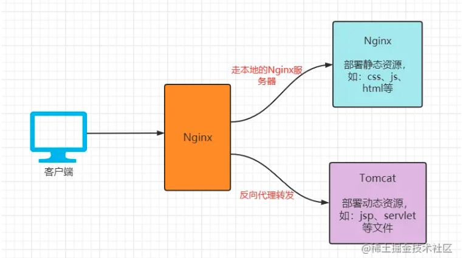

#####动静分离
区别：
- 静态资源：用户多次访问，资源的源代码永远不会改变。
- 动态资源：用户多次访问，资源的源代码可能发生改变。

####什么是动静分离？
- 动静分离是让动态网站的动态网页根据一定规则把不变的资源与变的资源区分开来，动静资源做好拆分以后，我们就可以根据静态资源的特点做缓存操作，这就是网站静态化处理的核心思路。

- 简单的概括就是：动态文件与静态文件的分离。

####为什么用动静分离？
为了加快网站的访问速度，把动态资源与静态资源用不同的服务器来解析，加快解析速度，降低单个服务器的压力。
