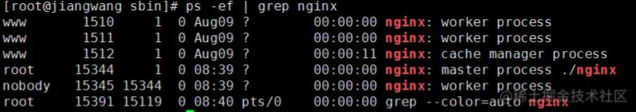
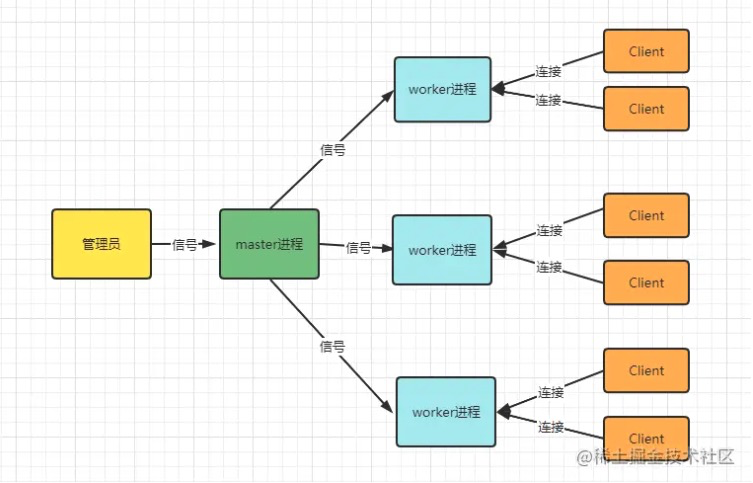
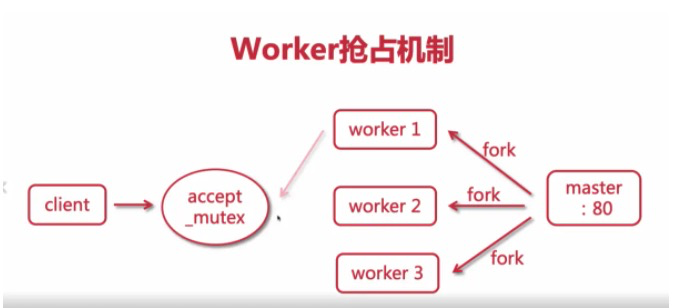

####nginx工作原理
master&worker模式 

master进程管理work进程。管理包含：接受来自外界的信号，向work进程发送信号，监控work进程状态，当work进程退出后(异常状态)，重新启动新的work进程。 
而基本的网络事件都放在了work进程处理。多个work之前是对等的、独立的，他们同等竞争来自客户端的请求。 
work进程数是可以设置的，我们一般设置为与cpu核数一致。

master接受信号后，将任务分配给work进行执行，work可以是多个

####work如何工作呢？

客户端发送一个请求到master后，work获取任务的方式不是轮询，而是抢占。 
在master里面先建立fd，然后fork出多个work进程，当请求进入nginx服务的时候，每个worker进程的fd变的可读，并且这些worker会抢占一个accept_mutex的锁，一个worker得到accept_mutex这个互斥量，其他的worker就不能占有。抢到这个accept_mutex的worker就开始读取请求-解析请求-处理请求，数据彻底返回到客户端后，整个事件结束。